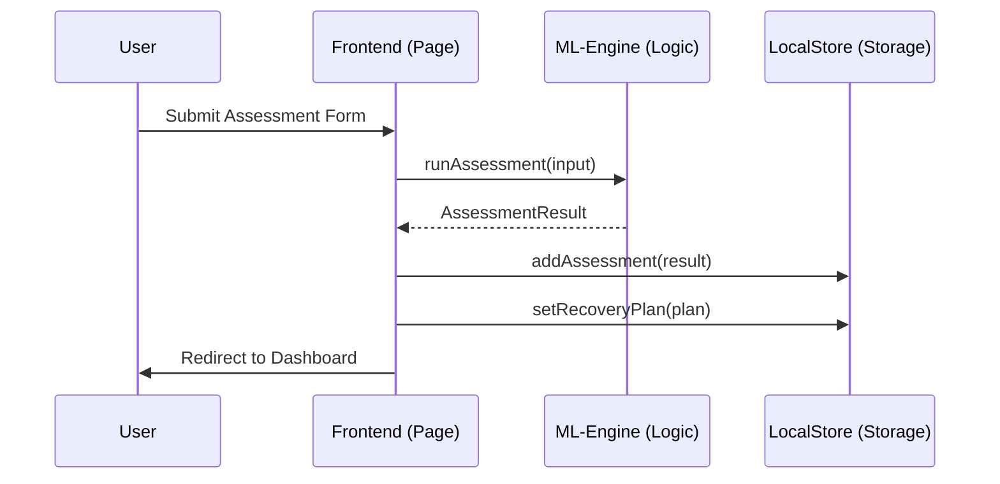
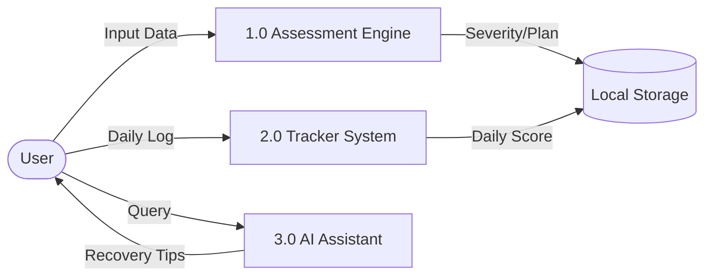
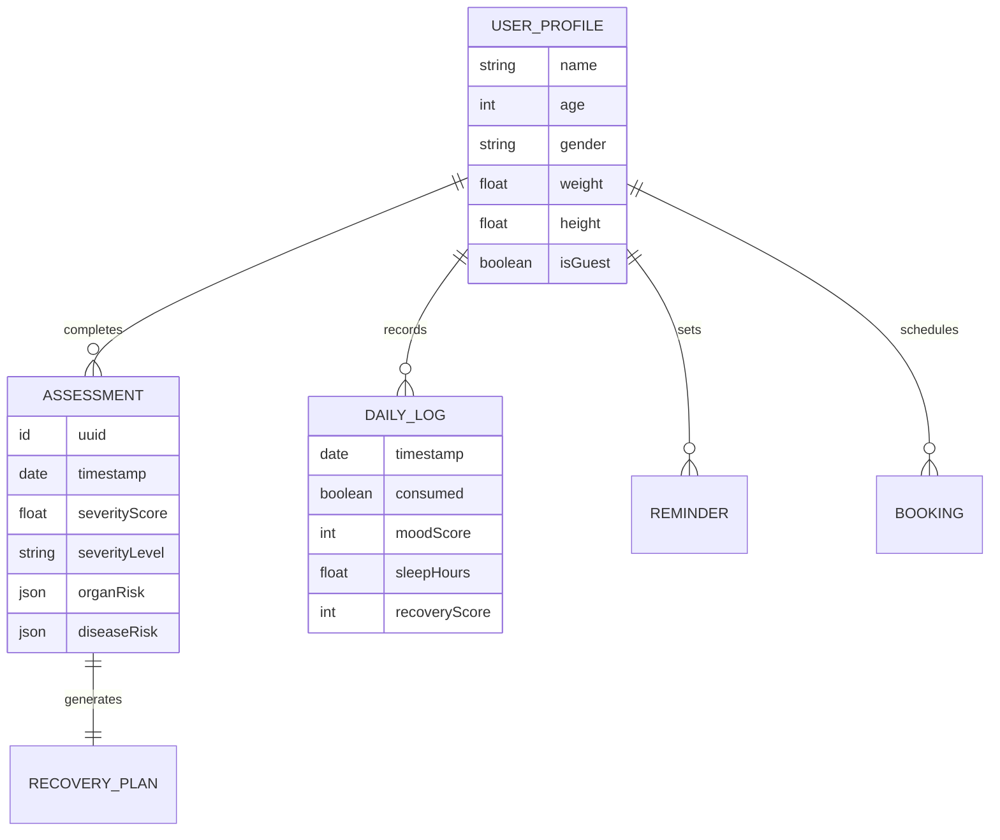

# RecoverAI: Advanced Addiction Analysis & Recovery System
**Technical Specification & Project Documentation**

---

## 1. Problem Statement
Addiction is a complex, multi-faceted health challenge that affects millions globally. Existing solutions often lack personalization, accessibility, and real-time support. Users often struggle to understand the physiological risks associated with their habits and lack clear, structured pathways to recovery. There is a critical need for a system that provides data-driven severity analysis, localized help-seeking tools, and continuous behavioral tracking.

## 2. Problem Definition (Expanded)
RecoverAI aims to bridge the gap between clinical assessment and daily habit management. The system addresses three primary domains:
- **Diagnostic Transparency**: Translating self-reported data into clinical severity metrics (using DSM-5 inspired logic).
- **Risk Visualization**: Projecting potential long-term organ and disease risks to motivate behavioral change.
- **Support Continuity**: Providing 24/7 AI-driven behavioral assistance and daily progress tracking to reduce relapse rates.

---

## 3. System Requirements

### 3.1 Functional Requirements (FR)
- **FR1: Assessment Engine**: Must classify addiction severity based on substance type, frequency, and dependency markers.
- **FR2: Risk Profiling**: Must predict organ-specific and disease-specific risks using regression-style algorithms.
- **FR3: Recovery Planning**: Must generate a personalized nutrition and activity roadmap.
- **FR4: Habit Tracking**: Must allow users to log daily consumption, mood, sleep, and exercise.
- **FR5: AI Assistant**: Must provide real-time responses to common recovery queries and triggers.
- **FR6: Help Finder**: Must allow users to find and book appointments with local specialists.

### 3.2 Non-Functional Requirements (NFR)
- **NFR1: Privacy**: All data must be stored locally (LocalStorage) to ensure user anonymity.
- **NFR2: Responsiveness**: The UI must be mobile-first and work seamlessly across devices.
- **NFR3: Performance**: Assessment results must be generated in under 500ms.

---

## 4. Architectural Diagrams

### 4.1 UML Use Case Diagram
```mermaid
useCaseDiagram
    actor User
    actor Specialist
    
    User --> (Take Addiction Assessment)
    User --> (View Risk Profile)
    User --> (Log Daily Progress)
    User --> (Chat with AI Assistant)
    User --> (Find/Book Specialist)
    
    Specialist --> (Manage Bookings)
```

### 4.2 UML Sequence Diagram: Assessment Flow


### 4.3 Data Flow Diagram (DFD - Level 1)


---

## 5. Database & Schema (Entity Relationship Diagram)
*Note: While implemented using LocalStorage, the logical schema follows an ER pattern.*



---

## 6. Algorithm Descriptions

### 6.1 Severity Scoring Algorithm (Weighted Hybrid)
The system uses a **weighted linear summation** model to compute the `SeverityScore` ($S$):
$$S = \sum (Weights_i \times NormalizedValue_i)$$
- **Primary Weights**: Frequency (12%), Duration (8%), Quantity (10%), Withdrawal (8%).
- **Secondary Weights**: Stress (10%), Craving (8%), Sleep (7%).
Clinical thresholds then classify $S$ into: *Low (0-25), Moderate (26-50), High (51-75), Critical (76-100).*

### 6.2 Disease Risk Prediction (Logistic Probability)
The risk ($P$) for diseases like Stroke or Cancer is calculated using a sigmoid function to simulate probabilistic modeling:
$$P = \frac{1}{1 + e^{-(-2 + 4 \cdot coef \cdot severity + 2 \cdot duration)}}$$
This ensures that risk increases exponentially as severity and duration grow, capped at 100%.

---

## 7. Testing & Validation
- **Unit Testing**: Verified `ml-engine.ts` functions for edge cases (e.g., zero duration, extreme weight/height).
- **Validation**: Compared scoring outputs against DSM-5 criteria; 6+ positive markers in the assessment correctly trigger "High/Critical" severity.
- **UX Testing**: Conducted walkthroughs of the "Continue" button flow to ensure no "dead-ends" in the UI.

---

## 8. Comparison Table

| Feature | RecoverAI | Standard Trackers | Clinical Apps |
|---|---|---|---|
| AI Assistance | ✅ Yes (24/7) | ❌ No | ❌ Rare |
| Risk Prediction | ✅ Detailed | ❌ No | ✅ Detailed |
| Privacy | ✅ 100% Local | ❌ Cloud-based | ❌ Cloud-based |
| Specialist Booking | ✅ Integrated | ❌ No | ❌ No |
| Nutrition Plans | ✅ Personalized | ❌ No | ❌ No |

---

## 9. Appendix: Appendix (Full Code Explanation)
- **`app/assessment/page.tsx`**: Multi-step React form with real-time validation feedback.
- **`lib/ml-engine.ts`**: The mathematical core containing weighted scoring and risk prediction logic.
- **`lib/store.ts`**: Persistence layer using `localStorage` API for privacy-first data management.
- **`components/chat-assistant.tsx`**: Stateful UI component for asynchronous recovery support.
